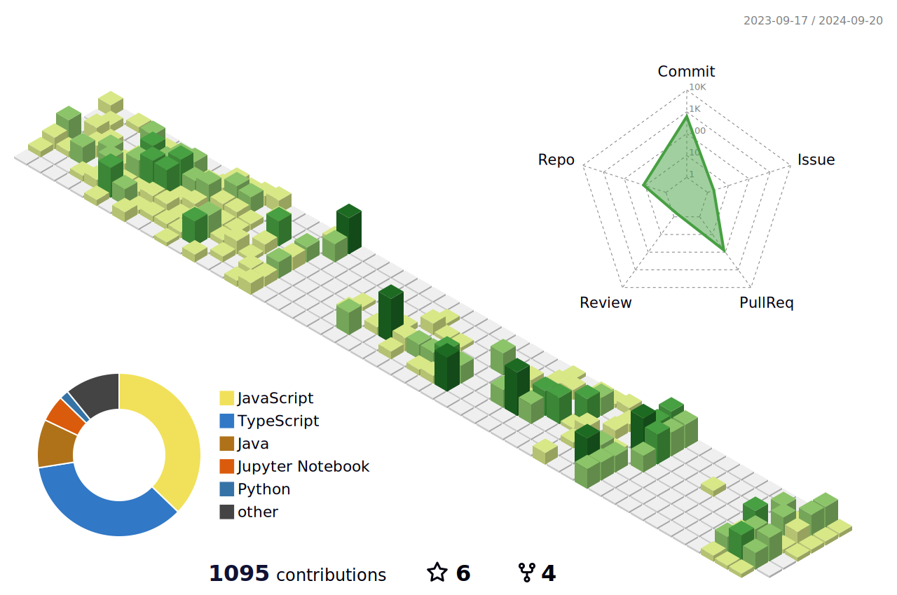

<!-- Header Section -->

## 😀 About Me

안녕하세요, 가치 있는 일이라면 노력을 아끼지 않는 FE 개발자, 전유정입니다.

## 🗣️ How do I cooperate

목표를 향해 나아가는 사람들이 함께 시너지를 발휘할 수 있는 <strong>건강한 조직 문화</strong>를 위해, 긍정적인 마인드로 임하려고 노력합니다.

## 🤩 Interests

    <ul>
        <li>여행🌴 - 국내외 여행다니는것을 좋아합니다.</li>
        <li>카페☕️ - 카페에 가서 다같이 코딩하는걸 즐깁니다. 함께 모각코해요!</li>
    </ul>

## 💻 Experience
<ul> 
    <li>[신한투자증권] 프로디지털아카데미 교육생 (2024.09 ~ 현재)</li> 
    <li>[씨비파이낸셜솔루션] 프론트엔드 개발 인턴 (2023.09 ~ 2024.01)</li> 
    <li>[한국핀테크지원센터] 2023 핀테크 인턴십 코스 4기 교육생 (2022.03 ~ 2023.01)</li> 
    <li>[IT 연합동아리 코테이토] 부회장, 부원 (2021.07 ~ 2023.07)</li> 
</ul>

## 📚 Certification
<ul> 
    <li>정보처리기사</li> 
    <li>SQLD</li> 
    <li>ADSP</li> 

</ul>

## 🏆 Awards 
<table>
    <thead>
        <tr>
            <th>기간</th>
            <th>상훈명</th>
            <th>내역</th>
        </tr>
    </thead>
    <tbody>
           <tr>
            <td>2024.11.22</td>
            <td>[신한라이프] 제 3회 신한 빅데이터 해커톤</td>
            <td>우수상</td>
        </tr>
        <tr>
            <td>2023.08.23</td>
            <td>[한국핀테크지원센터] 핀테크 해커톤 2023</td>
            <td>우수상</td>
        </tr>
        <tr>
            <td>2023.08.23</td>
            <td>[IT 연합동아리 코테이토] 제 1회 해커톤 대회</td>
            <td>은상</td>
        </tr>
        <tr>
            <td>2022.10.07</td>
            <td>[신한은행] 제 1회 신한 빅데이터 해커톤</td>
            <td>우수상</td>
        </tr>
        <tr>
            <td>2021.07.02</td>
            <td>[삼성카드] 제 2회 삼성카드 빅데이터 & 아이디어 공모전</td>
            <td>장려상</td>
        </tr>
    </tbody>
</table>

## ⚙️ Tech Stack

    <h4> Language </h4>
    

  

    <h4>Framework & Library & skils</h4>
    <a href="https://skillicons.dev">
        
        
        
        
        
        
        
    </a>

    <h4>Etc</h4>
    

## 📚 GitHub Stats
<!-- GitHub Stats -->

<!-- Contribution Graph -->

## 🔅 Follow Me 

    
    
    

